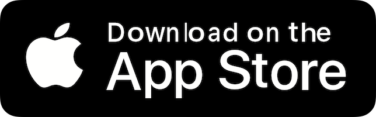
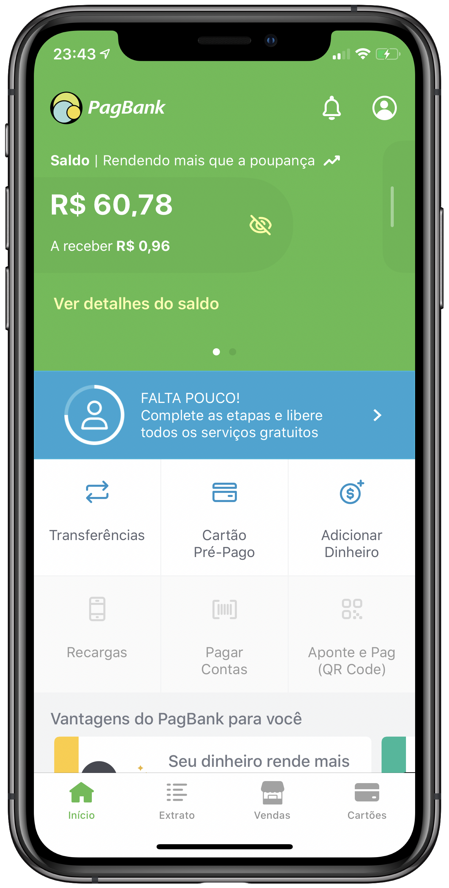
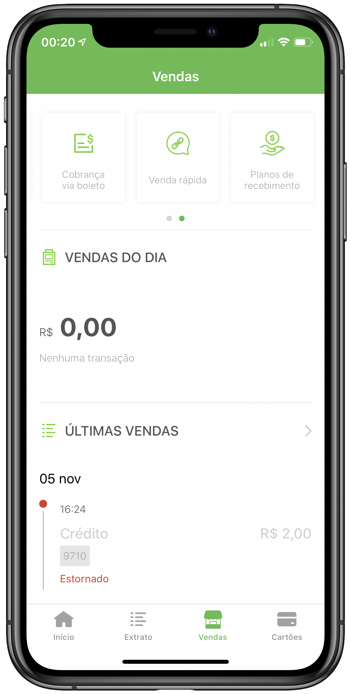
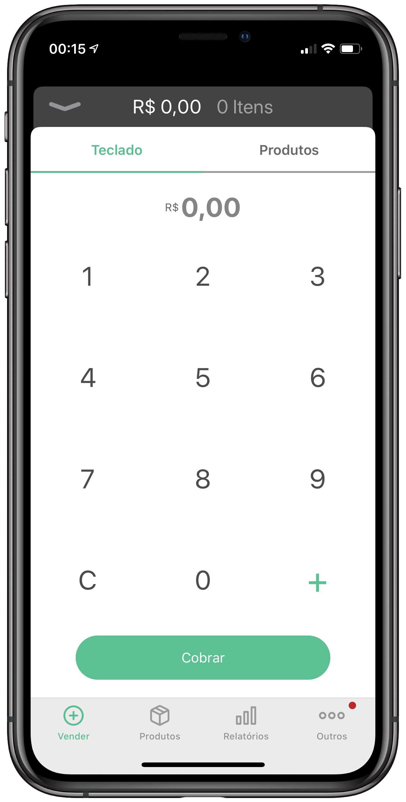
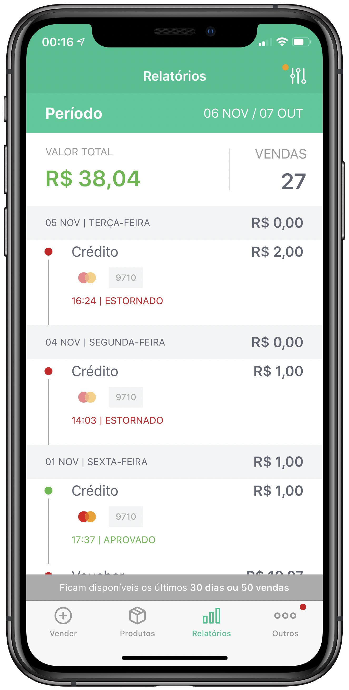

<!-- markdownlint-disable MD033 -->

 

<h1 align="center">John Lima</h1>
<h3 align="center">iOS Developer</h3>

 
 
 
 
 

I'm passionate about technology, science, developing things that improve people's lives and make the world a better place. I've been working with mobile development for iOS platform since 2014 with experience on all steps of iOS development, from the concept of the ideas until releasing the app on the store and following the results with analytics, tests and crash reports.

<h1 align="center">Work Experience</h1>

 

<h3 align="center">PagBank - PagSeguro</h3>

 

 PagBank is a very popular digital bank located in Brazil. 
 I'm working in this project since 2018 using Swift, web services integration, external frameworks, analytics implementation, SwiftLint, UnitTest, UITest, MVVM-C, git, code review, Jira, Jenkins and fastlane.

 
 

 

<h3 align="center">Vendas - PagSeguro</h3>

 

 PagSeguro Vendas is great app located in Brazil, used by a salesperson. 
 I'm working in this project since 2018 using Swift, external frameworks, SwiftLint, UnitTest, UITest, Viper, reactive programming, git, code review, Jira, Jenkins and fastlane.

 
 

 

<h3 align="center">Itau</h3>

 

 Itau is a bigger bank located in Brazil. 
 I worked in this project from 2017 to 2018 using Swift and Objective-C, web services integration, external frameworks, cocoapods, accessibility, UnitTest, MVC, git, GitLab and Scrum.

 

<h1 align="center">Open Source Projects</h1>

 

<h3 align="center">Frameworks</h3>

 <a href="https://github.com/thejohnlima/BaseNetworkKit"><b>BaseNetworkKit</b></a> 
 <a href="https://github.com/thejohnlima/BaseTracking"><b>BaseTracking</b></a> 
 <a href="https://github.com/thejohnlima/LMLoading"><b>LMLoading</b></a> 
 <a href="https://github.com/thejohnlima/ObservableKit"><b>ObservableKit</b></a> 
 <a href="https://github.com/thejohnlima/PickImageAlert"><b>PickImageAlert</b></a> 
 <a href="https://github.com/thejohnlima/SWMailgun"><b>SWMailgun</b></a> 
 <a href="https://github.com/thejohnlima/MoonKit"><b>MoonKit</b></a> 
 <a href="https://github.com/thejohnlima/LMStorage"><b>LMStorage</b></a> 

